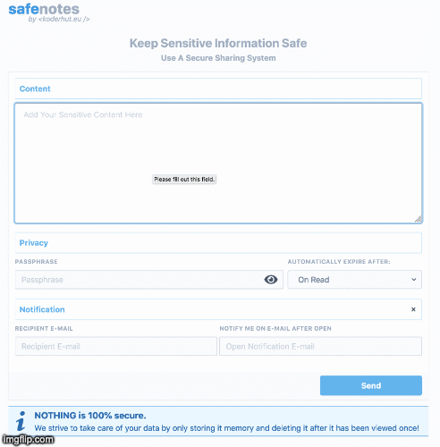

# SafeNotes

[](https://circleci.com/gh/koderhut/safenotes)


A self-hosting app that allows to quickly and securely exchange sensitive information, such as credentials.

<p align="center"></p>

## Features
- client-side only encryption and decryption of the note's content, the server receives only the encrypted note
- link to view the note can be sent automatically via email by the application, increasing security by delivering the passphrase through a separate channel different from the one where the passphrase is sent
- note's content has limited formatting support at the moment, with plans to add support for more specific data formatting (ie. forms for credentials, markdown editing and rendering)
- automatic note deletion after first open or after a specific time period
- the content is being kept secure only in-memory and removed after first read 
- UI can be easily personalized with specific logo and email templates can be edited as needed
- free to use in almost all situations - checkout the (License)[https://github.com/koderhut/safenotes/blob/master/LICENSE]

## Feature that will be developed
- credentials specific form
- store the note on the client side during the browsing session
- redis support for storing the notes
- i18n support for the frontend app
- dark theme
- OpenAPI support for the backend
- improved stats and monitoring
- rate limiting for the API calls
- add release packages for all platforms

If you are considering other features that might go well with the app please let me know by creating a feature request issue.
I plan a 1-2 months release cycle with security fixes released immediately.

## 🚀 Getting started
See [installation notes in docs.](./docs/install.md)

## 🔧 Usage
If you installed the application locally just run the following command:

```
$ ./safenotes serve
```

## Support
Support is available through the Github Issues. If you find any bugs with the app please feel free to open an issue.
For security issues please check the [security.md file](./security.md)

## Sponsors
I am happy to say that  [Jetbrains](https://www.jetbrains.com/?from=safenotes) 
is supporting this application's development through their [Open-Source sponsorship program.](https://www.jetbrains.com/?from=safenotes) 
Thank you Jetbrains!

## Contributors
Contributors are always welcomed and contributions are appreciated. If you would like to help the project in any way please check the [contributors guidelines at contributors.md](./contributing.md).

## :technologist: Tech stack
- Frontend is using React, TailwindCSS and CryptoJs.
- Backend is using Go.

# Third-party
- Icons used in frontend app made by [Vectors Market](https://www.flaticon.com/authors/vectors-market) from [www.flaticon.com](https://www.flaticon.com/) 
- Email templates are courtesy of: [ColorlibHQ](https://github.com/ColorlibHQ/email-templates) 

## 📄 License
Check license file found in the repository
